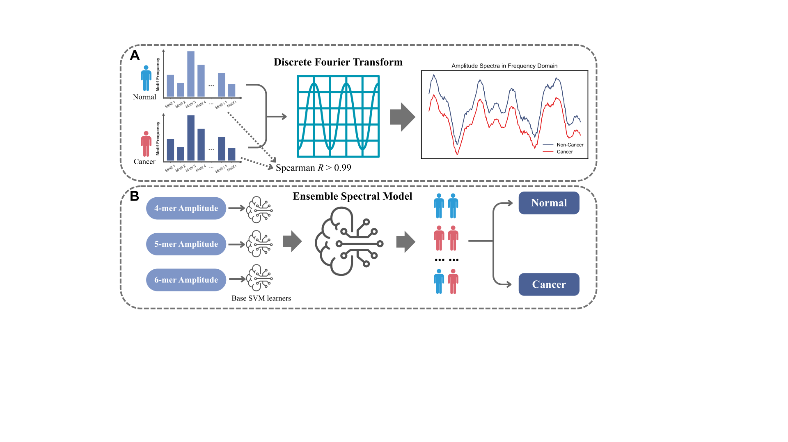

# DFT_code
Amplifying Pathological Signals in cfDNA End-Motif Profiles via Discrete Fourier Transform

## Description
This repository provides a digital signal processing (DSP) framework that utilizes the **Discrete Fourier Transform (DFT)** to amplify subtle **pathological signals** within cell-free DNA (cfDNA) end-motif (EDM) profiles. By treating k-mer frequency distributions as discrete signals, this method extracts frequency-domain amplitude spectra to unmask tumor-derived perturbations often submerged by dominant hematopoietic backgrounds.

## Overview


1. Preprocessing: Standardized BAM/BED processing to filter fragments (20–600 bp, MAPQ ≥ 30).
2. Feature Extraction: Calculation of 5' end-motif frequencies for k = 4, 5, and 6.
3. Spectral Transformation: Z-score standardization and Softmax mapping followed by FFT to extract amplitude spectra.
4. Classification: Training of SVM base learners on spectral features and final prediction via a meta-classifier.

## Project Structure


## Installation
We recommend using Conda to manage the environment.

```bash
# Clone the repository
git clone https://github.com/Upupdownn/DFT_code.git
cd DFT_code

# Create the environment
conda env create -f environment.yml

# Activate the environment
conda activate dft_analysis
```

## Preparation

The DFT pipeline supports two input formats for starting the analysis. You can either provide raw alignment files (BAM) or pre-processed fragment files (TSV).

**1. Input Fragment Data**

* **Option A: BAM Files**

  * Standard genomic alignment files are supported.

  * **Requirements:** Files must be sorted and indexed (e.g., sample.bam and sample.bam.bai).

* **Option B: Fragment TSV Files**

  * If you have already extracted fragment information, provide a TSV file with a header and the following columns: chr, start, end, mapq, and strand.

  * **Example Data:** For testing purposes, sample fragment TSV files are provided in the `examples/frag_file/` directory.

**2. Reference Genome (2bit format)**

A `.2bit` file of the reference genome is required for sequence extraction and end-motif frequency calculation. Please choose the version (e.g., hg19 or hg38) that matches your alignment.

To run the provided example dataset, you can download the hg19 reference genome using the following command:

```Bash
# Download hg19 reference genome from UCSC
wget http://hgdownload.cse.ucsc.edu/goldenPath/hg19/bigZips/hg19.2bit
```

**Note:** Ensure the path to the .2bit file is correctly passed to the --tb_file argument in the workflow script.

## Usage for scripts
All scripts can be used with the `-h/--help` option to view their help documentation.

# Contacts
If you have any questions or feedback, please contact us at:

Email: upupdownn@gmail.com

# Software License

This project is licensed under the MIT License - see the [LICENSE](LICENSE) file for details.