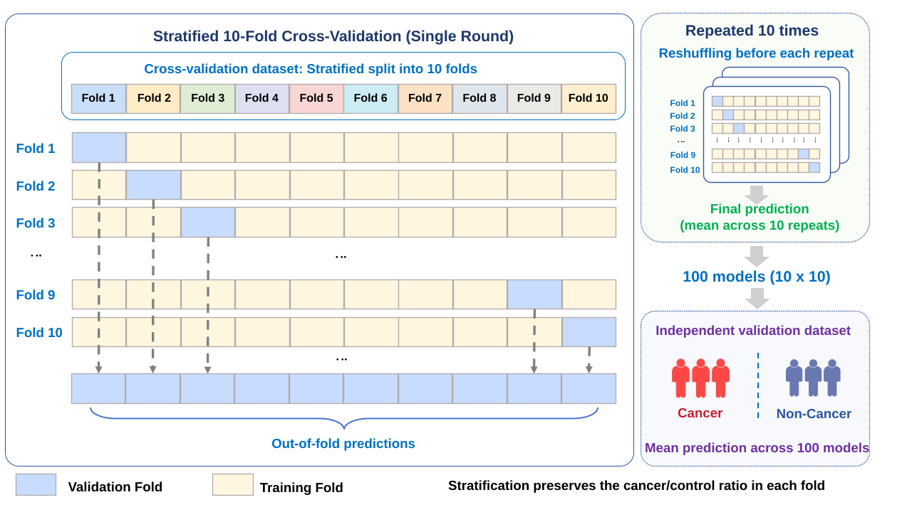
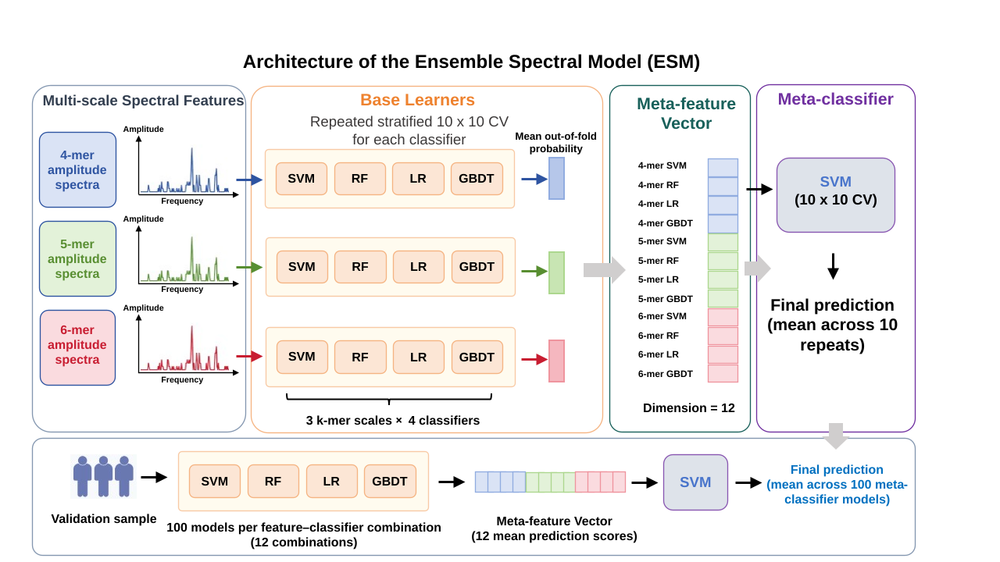

# DFT_code
Frequency-Domain Transformation of cfDNA End-Motif Profiles Enhances Robust Cancer Detection

## Description
This repository provides code and example workflows for frequency-domain transformation, model construction, statistical evaluation, motif interpretation, and figure generation of cfDNA end-motif profiles.

## Overview


1. Feature Extraction: Calculation of 5' end-motif frequencies for k = 4, 5, and 6.
2. Spectral Transformation: Z-score standardization and Softmax mapping followed by FFT to extract amplitude spectra.
3. Classification: Training base learners on spectral features and final prediction via a meta-classifier.

## Repository Structure
```text
DFT_code/
├── data/                                  # Feature and metadata files
├── examples/                              # Small example inputs for quick testing
├── scripts/
│   ├── core/                              # Core modeling workflow
│   │   ├── transform_features.py          # EDM → FFT/DCT/wavelet features
│   │   ├── run_cv_models.py               # Repeated cross-validation for single models
│   │   ├── run_svm_model.py               # Train SVM and validate on external dataset
│   │   └── run_ESM.py                     # Ensemble Spectrum Model pipeline
│   ├── preprocessing/                     # Data preparation
│   │   ├── bam_to_fragment_tsv.py         # BAM → fragment TSV
│   │   ├── extract_edm_from_fragments.py  # Fragment TSV → end-motif frequency table
│   │   ├── merge_edm_features.py          # Merge per-sample features into matrix
│   │   └── calculate_mds.py               # Calculate Motif Diversity Score
│   ├── statistics/                        # Statistical evaluation
│   │   ├── run_score_summary.py           # AUC, CI, and sensitivity summary
│   │   ├── run_delong_test.py             # DeLong test between ROC curves
│   │   ├── run_permutation_test.py        # Permutation test
│   │   └── run_feature_u_test.py          # Feature-wise U test with FDR correction
│   ├── plotting/                          # Visualization scripts for main figures
│   ├── interpretation/                    # Frequency-guided motif interpretation analyses
│   └── utils/                             # Shared utility functions used across scripts
└── README.md
```

## Installation
We recommend using Conda to manage the environment.

```bash
# Clone the repository
git clone https://github.com/Upupdownn/DFT_code.git
cd DFT_code

# Create the environment
conda env create -f environment.yml

# Activate the environment
conda activate dft_analysis
```

## Preparation

The DFT pipeline supports two input formats for starting the analysis. You can either provide raw alignment files (BAM) or pre-processed fragment files (TSV).

**1. Input Fragment Data**

* **Option A: BAM Files**

  * Standard genomic alignment files are supported.

  * **Requirements:** Files must be sorted and indexed (e.g., sample.bam and sample.bam.bai).

* **Option B: Fragment TSV Files**

  * If you have already extracted fragment information, provide a TSV file with a header and the following columns: chr, start, end, mapq, and strand.

  * **Example Data:** For testing purposes, sample fragment TSV files are provided in the `examples/frag_file/` directory.

**2. Reference Genome (2bit format)**

A `.2bit` file of the reference genome is required for sequence extraction and end-motif frequency calculation. Please choose the version (e.g., hg19 or hg38) that matches your alignment.

To run the provided example dataset, you can download the hg19 reference genome using the following command:

```Bash
# Download hg19 reference genome from UCSC
wget http://hgdownload.cse.ucsc.edu/goldenPath/hg19/bigZips/hg19.2bit
```

## Usage
### Notes
All scripts can be used with the `-h/--help` option to view their help documentation.

### Step 1. Convert BAM to Fragment TSV
Convert paired-end BAM files into fragment-level TSV format.
```bash
python scripts/preprocessing/bam_to_fragment_tsv.py sample.bam sample.fragments.tsv
```

Output columns:
```text
chr | start | end | mapq | strand
```

### Step 2. Extract End-Motif Features
Calculate 5′ cfDNA end-motif frequencies from fragment files.
Example for 4-mer:
```bash
python scripts/preprocessing/extract_edm_from_fragments.py \
    sample.fragments.tsv \
    hg19.2bit \
    sample.4mer.tsv \
    -k 4
```
You can repeat for 5-mer and 6-mer.

### Step 3. Merge Sample-Level Features

Merge per-sample EDM frequency tables into one feature matrix.

```bash
python scripts/preprocessing/merge_edm_features.py \
    input_4mer_dir \
    --merged_output 4mer_matrix.tsv
```
Output:
```text
rows    = samples
columns = k-mer features
```

### Step 4. Frequency-Domain Transformation

Transform EDM frequency matrix into frequency-domain features.

```bash
python scripts/core/transform_features.py \
    4mer_matrix.tsv \
    transformed_features/
```

Generated outputs include:
* FFT amplitude
```text
fft_amplitude_full.tsv
fft_amplitude_processed.tsv
```
* FFT phase
```text
fft_phase_full.tsv
fft_phase_processed.tsv
```
* DCT features
```text
dct_features.tsv
```
* Wavelet features
```text
wavelet_features.tsv
```

The processed DFT amplitude features correspond to:

```text
Half spectrum
- remove symmetric redundancy
- remove DC component
```

which were used for model construction in this study.

### Step 5. Build the Ensemble Spectrum Model (ESM)

Train the final ESM classifier using transformed multi-scale features.
```bash
python scripts/core/run_ESM.py \
    cv_feature_dir \
    cv_info.tsv \
    cv_score.tsv \
    --val_feature_dir val_feature_dir \
    --val_info_tsv val_info.tsv \
    --val_score_tsv val_score.tsv
```

#### Input

`cv_feature_dir` should contain one feature file per scale:
```text
4mer.tsv
5mer.tsv
6mer.tsv
```

Validation directory should contain matching files with identical names.

#### ESM workflow

For each scale:
```text
4-mer / 5-mer / 6-mer
```

four base learners are trained:
```text
SVM
Logistic Regression
Random Forest
Gradient Boosting
```

Their out-of-fold prediction scores are combined into meta-features, followed by a second-level SVM classifier.

## Model Illustration

### Repeated 10-Fold Cross-Validation

The repeated cross-validation strategy used for out-of-fold score generation is illustrated below.



### Ensemble Spectrum Model

The ESM framework integrates multi-scale spectral features and multiple base learners through a second-level SVM classifier.



## Contacts
If you have any questions or feedback, please contact us at:

Email: upupdownn@gmail.com

## Software License

This project is licensed under the MIT License - see the [LICENSE](LICENSE) file for details.
